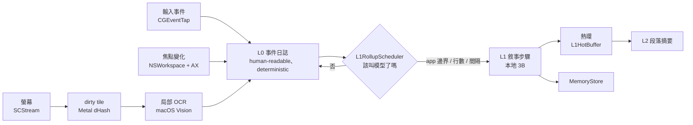
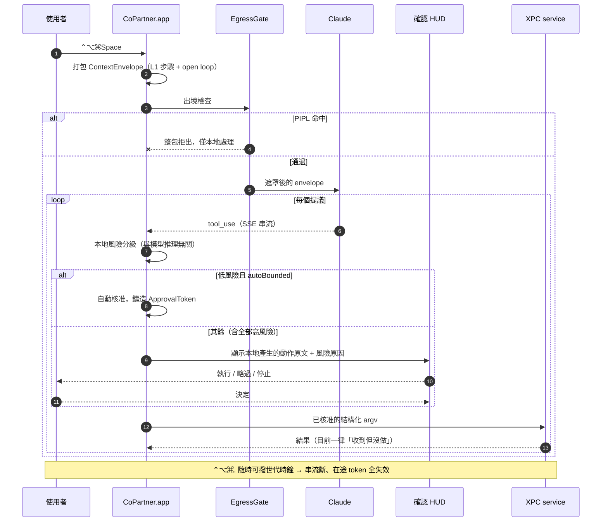
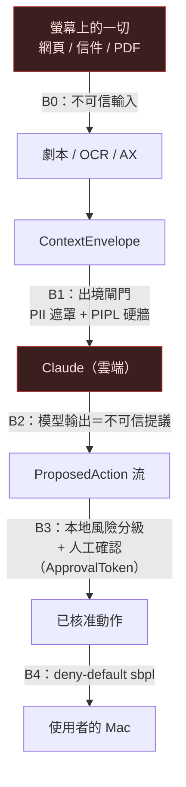

# 資料流

兩條路徑：**常時觀察**（一直在跑）與**接手**（熱鍵觸發）。

## 常時觀察

**兩個容易踩的地方**（都真機踩過）：

- **新活動偵測不能用行數差**。`EventLog.record` 會就地改寫最後一行（打字合併、捲動聚合），
  而 `EventLogFeed` 是 ring buffer——兩者各自都足以讓行數差永久歸零。改用 `(行數, 末行內容)` 指紋。
- **視窗標題不是視窗身分**。終端機把尺寸寫進標題、AX 有時整個讀不到、
  而 app 名稱與標題來自兩個獨立來源、切換瞬間會不同步。詳見 `FocusChangeTracker` 檔頭的四次教訓。

## 接手

⚠️ 圖中最後一步目前**刻意**是「收到但沒做」：執行能力尚未開啟（backlog step 53.5）。
佔位一律 throw、絕不靜默假裝成功——否則後面每一次驗收都建立在一個假的成功上。

## 信任邊界

**核心立場**：防線不依賴「模型乖」。B0 假設螢幕內容含針對 AI 的注入指令；
B2 假設模型即使沒被注入也會犯錯。真正擋住事情的是 B3 與 B4 這兩道**本地硬邊界**。

威脅列舉（T1–T10）與可測不變式（I1–I10）見
[`sandbox-threat-model.md`](../design/sandbox-threat-model.md)。
