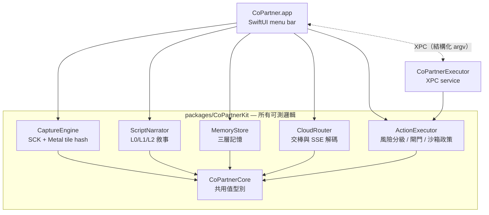
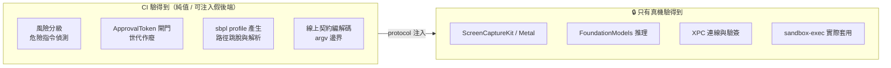

# 架構總覽

> 圖表一律用 **Mermaid**：純文字、可 diff、GitHub 直接算圖，改一行就好。

CoPartner 是混合式（本地 + 雲端）ambient AI 代理。三大支柱：

1. **Smart Capture Engine**（`CaptureEngine`）— foveated / dirty-region 螢幕擷取。
2. **Action Script Narrator**（`ScriptNarrator`）— 本地模型把操作寫成滾動劇本。
3. **Cloud Takeover**（`CloudRouter` + `ActionExecutor`）— 熱鍵觸發時交棒給 Claude 續寫。

## 模組相依

實線＝相依；所有模組只共用 `CoPartnerCore` 的值型別，彼此不互相 import。
這是刻意的：模組之間若能互相引用，「純邏輯」與「平台膠水」的界線很快就會被磨掉。

## 為什麼可測邏輯全在 CoPartnerKit

開發代理跑在 **沒有 Mac、沒有螢幕、沒有權限**的 Linux 容器裡，所以平台膠水一律盲寫、
只能靠真機 dogfood 驗。應對方式是把界線畫在「CI 驗得到」與「只有真機驗得到」之間：

**判準**：如果一段程式碼的正確性取決於「餵給平台 API 的參數」，它就該在 CI 那一側——
`posix_spawn` 本身不會出錯，錯的是我們給它什麼。

## 橫切關注

| 關注 | 落點 |
|---|---|
| 隱私閘門 | `PIIMasker`（L0 文字）、`TileMaskPolicy`（像素）、`CaptureBlacklist`（app 源頭）、`EgressGate`（出境 PIPL 硬牆）|
| kill-switch | `HandoffGeneration` 世代時鐘——一撥全鏈作廢（串流、token、executor）|
| 稽核 | `ActionExecutor.auditLog`，attempt / executed / notExecuted / blocked 四種 |

詳細設計見 `docs/design/`；安全邊界見 [`sandbox-threat-model.md`](../design/sandbox-threat-model.md)。
