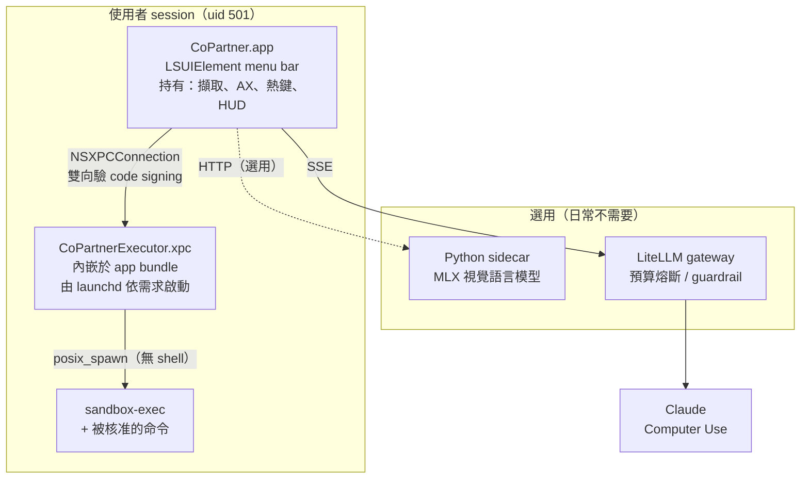

# 程序拓樸

三個**必要**程序（sidecar 與 gateway 是選用）。分程序的理由各不相同，值得分清楚。

## 每個邊界買到什麼

| 邊界 | 買到 | **沒有**買到 |
|---|---|---|
| app ↔ XPC service | 程序隔離、很窄的型別化介面、單一驗呼叫者的地方 | **不是權限降級**——內嵌 XPC service 必然與主 app 同 uid（真機實測 euid 501）|
| XPC service ↔ 被 spawn 的命令 | **真正的圍籬**：deny-default sbpl profile，斷網、讀寫限工作目錄 | 不涵蓋 UI 動作（點按/輸入天生在 session 權限內）|
| app ↔ 雲端 | PII 遮罩、PIPL 硬牆、預算熔斷 | 模型輸出仍是**不可信**的，防線在本地的風險分級與確認閘門 |

⚠️ 第一列那個「沒有買到」是真機實測推翻設計假設的結果——威脅模型原本寫「專用低權 helper」，
但那需要 launchd daemon + 管理員授權，內嵌 service 做不到。詳見威脅模型 §6 與 R5。

## 外部程序連得到 XPC endpoint 嗎

**連不到。** `scripts/xpc-probe.swift` 實測：外部程序以 `NSXPCConnection(serviceName:)`
連內嵌 service，得到「連線失效」。

因此 T7 的主要防線是 XPC service 的**內嵌類型**，code-signing 驗證是縱深防禦——
它的價值在於日後若改成對外可見的 launchd Mach service 就會變主防線。
