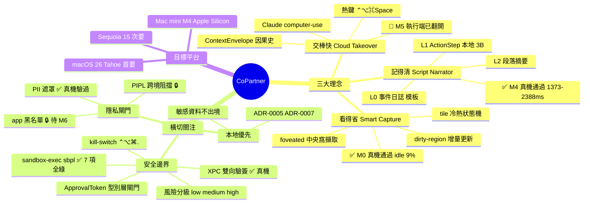
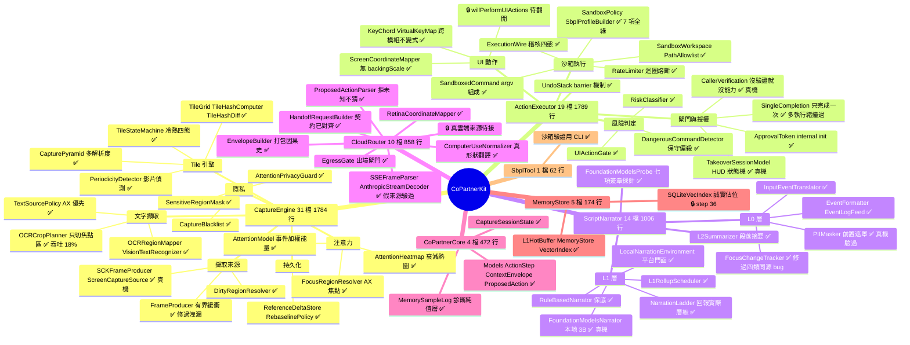
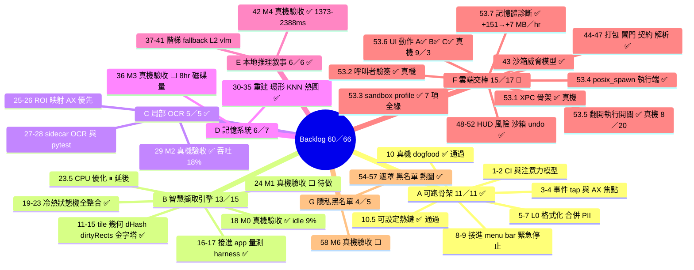
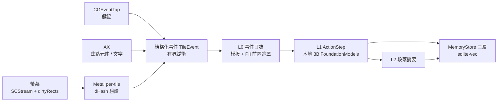
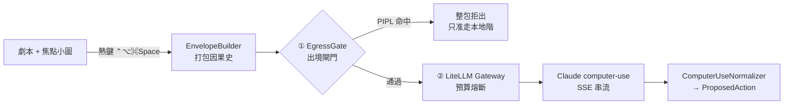
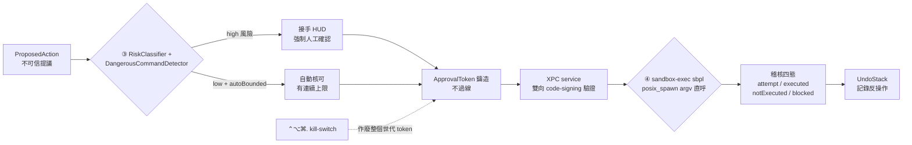
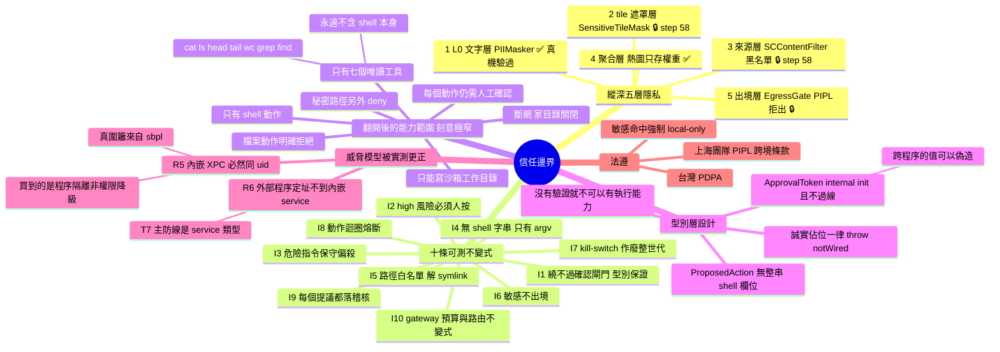
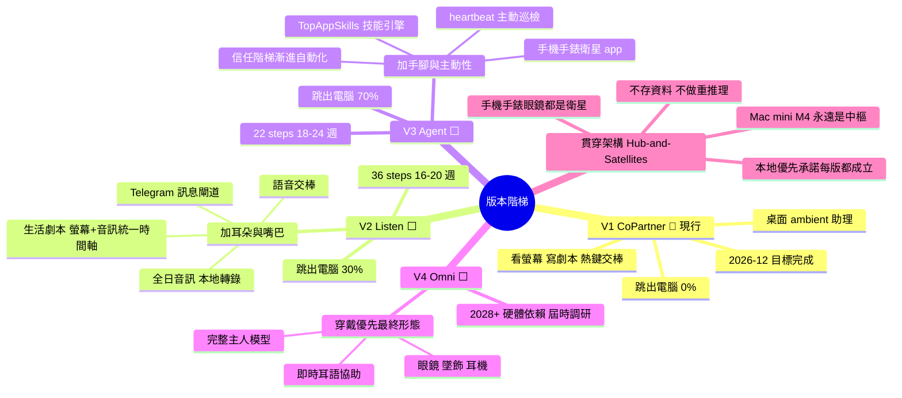
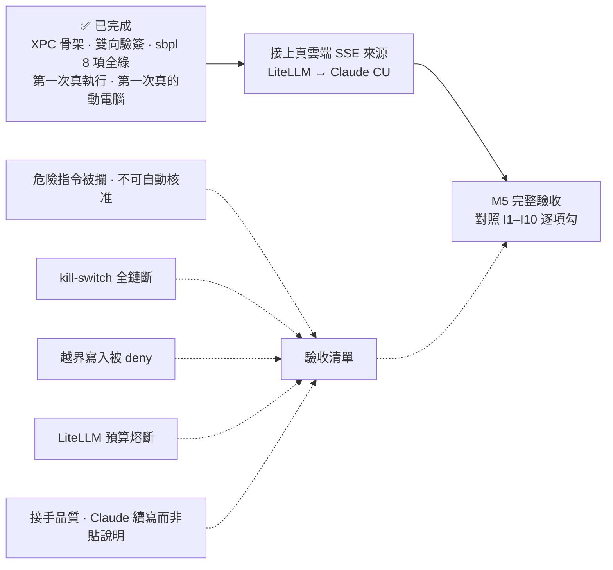
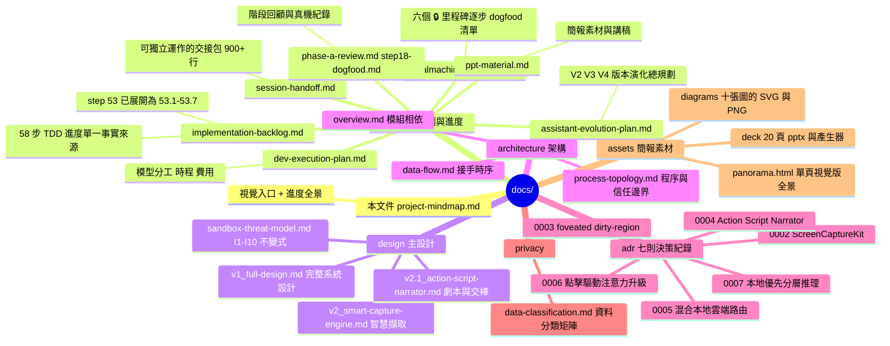

# CoPartner 專案心智圖與進度全景

> **單一視覺入口**：把整個專案——產品理念、系統架構、實作進度、里程碑戰績、安全邊界、版本階梯——收在一份文件裡，並在每個節點標上**真實進度**。
> 事實來源：`docs/planning/implementation-backlog.md`（步級）、`docs/planning/realmachine-runbook.md`（真機驗收）、`docs/planning/session-handoff.md`（脈絡）、git 歷史（42 個已合併 PR）。
> 最後同步：2026-09-02（`main` @ `a6d5dfd`）。

**狀態圖例**

| 標記 | 意義 |
|---|---|
| ✅ | 完成（CI 綠，或真機驗收通過）|
| 🔄 | 進行中 |
| 🔒 | 邏輯／程式碼已完成，等真機或真後端驗證 |
| ⏸ | 已評估過、刻意延後 |
| ⬜ | 未開始 |

> 🖼️ **做簡報的話**：本文件所有圖表已匯出成 SVG／PNG 放在 [`docs/assets/diagrams/`](assets/diagrams/)，
> 搭配 [`docs/planning/ppt-material.md`](planning/ppt-material.md) 的投影片大綱與講稿即可直接開工。
> 想直接投影或截圖的話，[`docs/assets/panorama.html`](assets/panorama.html) 是同樣內容的**單頁視覺版**；
> 要 PowerPoint 的話，[`docs/assets/deck/`](assets/deck/) 是做好的 20 頁 .pptx，每頁附講稿。

---

## 1. 一頁看懂

| 面向 | 現況 |
|---|---|
| **產品** | macOS 常駐 menu bar 的 ambient AI 助理：持續把你的操作寫成「操作劇本」，按熱鍵交棒給雲端 Claude 續做 |
| **階段** | **可運作的軟體**，不是骨架。app 在真機上持續觀察並敘事；執行能力已翻開（沙箱內、人工確認後），第一次真執行的驗收回報待補 |
| **步級進度** | **60 / 66 完成（91%）**——原 58 步 backlog，其中 step 53 展開成 53.1–53.7 |
| **里程碑** | M0 ✅・M1 ⬜・M2 ✅・M2.5 ✅・M3 ⬜・M4 ✅・**M5 🔄 大半已真機驗過**・M6 ⬜ |
| **程式碼** | Swift 8,606 行（100 檔）／測試 6,161 行（72 檔）／**595 個 XCTest**；Python sidecar 254 行 ／ 15 個 pytest |
| **交付節奏** | **48 個 PR 已合併**進 `main`，全部走 CI 三 job（macos-15）：`swift`・`python`・`app` |
| **最近里程** | 2026-08-20 **第一次真的執行命令**（`cat` 讀回檔案，UUID 對得上）；2026-09-02 記憶體洩漏定位並修復（+151 → **+7 MB/小時**）；2026-09-03 **第一次真的動使用者的電腦**（HUD 確認後畫面捲動） |
| **下一步** | 接上真雲端 SSE 來源；M5 完整驗收（I1–I10 逐項勾） |

---

## 2. 全景心智圖：這個專案是什麼



---

## 3. 系統架構心智圖：模組 × 檔案 × 狀態

七個 Swift target 共 **84 個原始檔**，加上 app 端 16 檔。核心原則：**平台重活藏在 protocol 後、CI 用假後端驗邏輯、真後端沒接就 `throw` 不假裝成功**。



**app 端**（`apps/CoPartner/`，16 檔 2,461 行）：

| 分區 | 檔案 | 狀態 |
|---|---|---|
| 主程序 | `CoPartnerApp`・`AppCoordinator`・`MenuBarContentView`・`SettingsView` | ✅ 真機 |
| 接手 HUD | `TakeoverHUDPanel`・`TakeoverHUDView` | ✅ 真機通過 |
| 執行端 | `XPCActionPerformer`・`UIActionPerformer`・`ScreenGeometryProvider` | ✅ shell／🔒 UI 旗標待翻 |
| XPC service | `Executor/ExecutorService`・`SandboxedCommandRunner`・`main` | ✅ 真機（pid 分離、驗簽通過）|
| 共用 | `Shared/ExecutorXPCProtocol`・`CodeSigningIdentity` | ✅ |
| 診斷 | `MemoryFootprint`・`MemoryLogWriter` | ✅ 用它抓到洩漏 |

---

## 4. 進度地圖：Phase A–G 與 M0–M6



### 4.1 里程碑戰績表

| 里程碑 | 交付物 | 驗收步 | 狀態 | 實測數字 |
|---|---|---|---|---|
| **M0** 擷取引擎原型 | SCK + dirtyRects + Metal dHash + 注意力 | 18 | ✅ 真機通過 | idle CPU **9%**、operating 25% |
| **M1** 冷熱狀態機 | tile 四態 + 影片降頻 + foveation 排程 | 24 | ⬜ 待做 | 前置 23.5 CPU 優化已延後 |
| **M2** 局部 OCR | Vision ROI OCR + AX 文字優先 | 29 | ✅ 真機通過 | 像素吞吐 **18%**（目標 ≤20%）|
| **M2.5** L0 EventLog | deterministic 模板劇本 | 10 | ✅ 真機通過 | 操作時間機器可 dogfood |
| **M3** 記憶系統 | reference+delta + sqlite-vec + 熱圖 | 36 | ⬜ 待做 | 目標 8hr ≤ ~400MB |
| **M4** 本地推理 L1／L2 | FoundationModels 3B + 敘事階梯 | 42 | ✅ 真機通過 | 延遲 **1373–2388ms**、fallback 驗證通過 |
| **M5** 雲端交棒 | LiteLLM + Claude CU + HUD + 沙箱執行 | 53.1–53.7 | 🔄 **執行端已建成** | XPC ✅・sbpl 7 項全綠 ✅・記憶體修復 ✅・執行開關已翻開 |
| **M6** 隱私黑名單 | tile 遮罩 + 黑名單 + 熱圖隱私 | 58 | ⬜ 待做 | 目標密碼欄 100% 遮、黑名單 0 frame |

### 4.2 進度統計

```
步級   ███████████████████░░  60 / 66  （91%）
里程碑  ████████████░░░░░░░░   4 / 8   完全通過（M0 M2 M2.5 M4）+ M5 進行中
PR      ████████████████████  42 個已合併進 main
```

**剩下的 4 項**：`23.5` 擷取 CPU 優化（⏸ 延後）、`24` M1 驗收、`36` M3 驗收、`58` M6 驗收。

（`53.5` 與 `53.6-C` 已於 2026-09-03 對帳補上：兩者的真機驗收分別在 8／20 與 9／3
就通過了，只是文件沒跟上——53.5 那次一驗完就轉進記憶體診斷，沒有人回頭打勾。）

---

## 5. 資料流心智圖：一次交棒發生了什麼

### 5.1 本地感知鏈（全部在你的 Mac 上，已真機驗過）



### 5.2 交棒鏈前半：出境閘門 → 雲端 → 提議



### 5.3 交棒鏈後半：風險閘 → 人工確認 → 沙箱執行



**目前的真實狀態**：整條鏈的程式碼都在，執行開關已於 2026-08-20 翻開。
驗證方式是一個**本地合成提議**走完全相同的路徑（風險分級 → HUD 人工確認 → token → 全部閘門 → XPC → sbpl）——
它不繞過任何閘門，只是把提議的來源從雲端換成本地，讓第一次真執行發生在完全受控的情況下。
**兩格還是假的**：「Claude computer-use」（真雲端 SSE 來源尚未接上，解析鏈用假來源驗過）
與 UI 動作（`willPerformUIActions` 旗標仍關著）。

---

## 6. 安全與隱私心智圖



---

## 7. 版本階梯心智圖：V1 → V4



---

## 8. 工程方法論（簡報最有料的一頁）

六條貫穿全案的原則，都是踩過坑換來的：

| 原則 | 內容 | 為什麼 |
|---|---|---|
| **可注入後端 + 誠實佔位** | 平台重活藏在 protocol 後，CI 用假後端驗邏輯；真後端沒接一律 `throw`，**絕不靜默假成功** | 開發代理跑在 Linux 容器、沒有 Mac，這是唯一能讓 92% 的工作在無真機下被驗證的辦法 |
| **安全不變式寫進型別** | `ApprovalToken` 的 `internal` init 讓「繞過閘門」在編譯層面不存在；`ProposedAction` 沒有整串 shell 欄位；`ApprovalToken` **不過 XPC**（跨程序的值可以偽造） | 防線不靠紀律、不靠 prompt，靠編譯器 |
| **先讓 endpoint 無害，再讓它有能力** | XPC service 先做成**沒有執行能力**的骨架，驗簽補上後才翻開開關；`willExecuteActions = true` 那一行**單獨成立一個 PR** | 翻開執行能力若混在一大包程式碼裡，沒有人（包括作者）能真的審完 |
| **build 綠 ≠ 真的編到了** | `canImport` 為 false 時整檔靜默略過、build 照樣綠 → `#if`／`#else` 兩側各放 `#warning` 取得**編譯期證據** | M4 的 FoundationModels 七項簽章，只有真機能當編譯器 |
| **驗證方式比被驗的東西重要** | 沙箱只測「擋得住」會得到假通過（deny-default 下什麼都跑不起來）→ **成對驗證**，負向結果**依賴**正向基準；基準沒過就全部標「無效」而非「通過」 | 一個測不出東西的測試，比沒有測試更危險 |
| **不猜、拒收、明講慣例** | parser 遇未知 tool 就拒收；修飾鍵無法表示就 `throw`；`KeyChord` 認不得就整個丟出錯誤 | 「認得幾個算幾個」會讓 HUD 顯示的與實際按下的不同 |

### 真機 dogfood 抓到、CI 永遠測不到的 bug

1. **FOCUS 狂刷** — 終端機每輸出一個字就被判定換視窗。*根因*：焦點追蹤誤用 AX `value`（欄位**內容**）當視窗識別。後來又抓到同源的另外三類（會變的標題／「讀不到」／兩個不同來源的欄位當身分），四條回歸測試釘住。
   **教訓：邏輯正確、測試也過——錯在真機餵給它的資料。**
2. **OCR 截整螢幕** — 混入選單列和其他 app 文字，吞吐等同沒優化。*修*：依 AX 焦點框裁切 → **18%**。
3. **Vision bbox 左下原點** — 與螢幕座標慣例相反，沿用會讓摘要**上下顛倒**。
4. **稽核不誠實** — 被閘門擋下的動作原本留下**零痕跡**；執行未成功時原本記成已執行。*修*：改成 attempt／executed／notExecuted／blocked 四態。
5. **記憶體線性成長** — 沒開觀察、只是讓 app 開著就會跳系統告警。七輪診斷後定位：`AsyncStream<TileEvent>` 沒指定 buffering policy（無上限），唯一的消費者是 `@MainActor` 計數器，每個事件跳一次 MainActor、產生端不會等它。*修*：`.bufferingNewest(64)` → **+151 MB/小時 降到 +7 MB/小時**。

### 診斷過程本身推翻了三個中途結論

一次性暖機被整體斜率攤成成長率／階段落差被攤成成長率／「ratchet 確認」其實是**量測時機**造成的假象（停止後 1–5 分鐘記憶體根本還沒開始掉，真正的落定點在 30 分鐘）。
每一次都是同一種錯誤：**一個看起來像資料的猜測，比「不知道」更糟。**

---

## 9. 關鍵路徑：M5 還剩什麼



**M5 之後的路線**：M3 真 vec0（step 36，盲寫風險低但要跑 8hr 驗磁碟量）→ M1 擷取 CPU 優化 + 影片驗收（23.5 + 24）→ M6 隱私最終審查（58）→ V1 收官 → V2 Listen 開工。

**兩件已知但刻意未處理的**：
- **L1 會編故事**：終端機標題 `CoPartner — -zsh — 100×34` 被 3B 腦補成「與 CoPartner 進行視訊會議」。指令已明寫禁止臆測，3B 壓不住。這是 L1 品質調校，與 M5 是兩條線。
- **同一個 app 內換視窗仍會記 FOCUS**：只有 CI 測試蓋到，下次 dogfood 開兩個終端機視窗切一下就能補驗。

---

## 10. 文件地圖



---

## 11. 維護方式

這份文件是**衍生視圖**，不是事實來源。更新順序永遠是：

1. 先改 `docs/planning/implementation-backlog.md` 的**進度總覽表 + 該 step 詳細章節**（兩處都要——過去多次只改一處造成漂移）。
2. 真機驗收結果同步進 `docs/planning/realmachine-runbook.md` 的對應里程碑節，脈絡進 `session-handoff.md`。
3. 里程碑翻牌時，回來更新本文件的 §1／§4／§9，以及 `README.md`／`README.en.md`／`CHANGELOG.md`。
4. 圖改了要重新匯出 `docs/assets/diagrams/`（方法見該目錄 README）；`docs/assets/panorama.html` 與 `docs/assets/deck/gen.js` 裡的數字都是硬寫的，一併更新。
